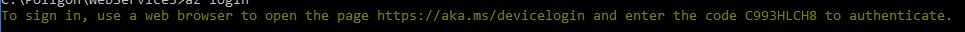
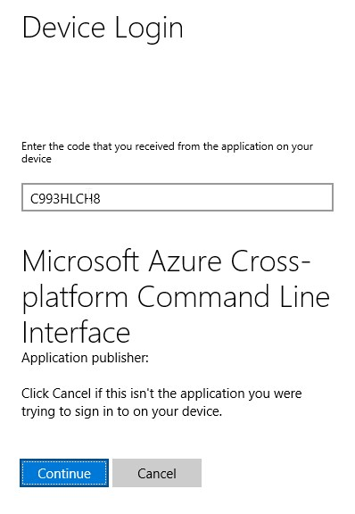
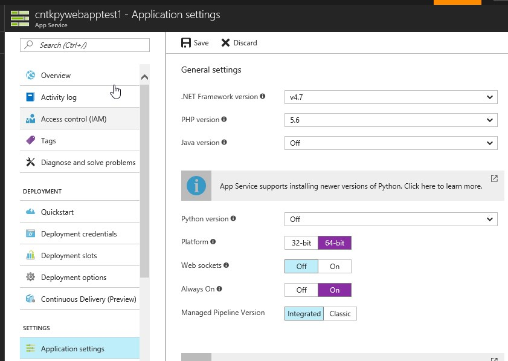
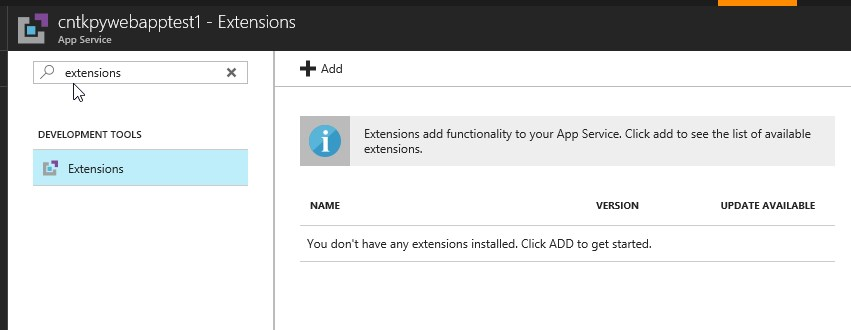
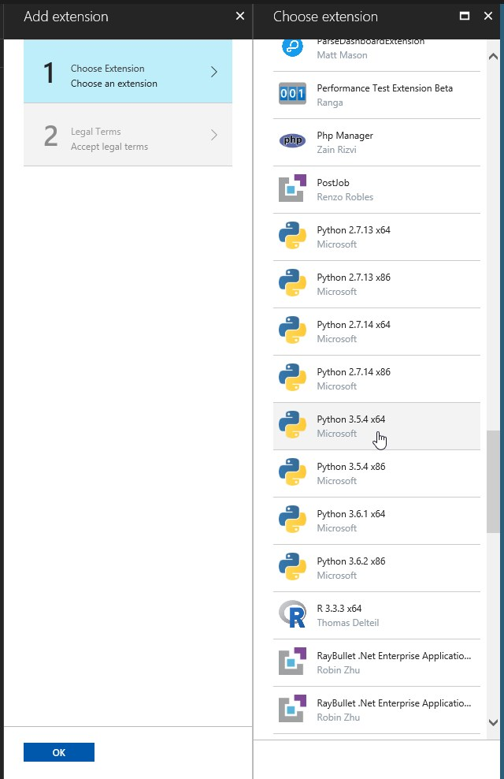
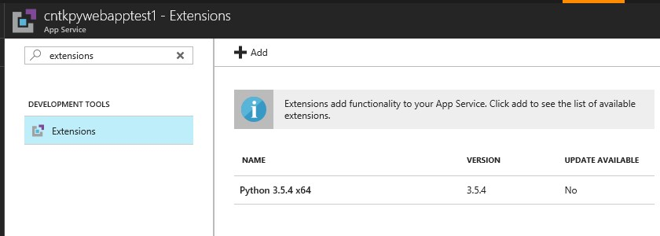
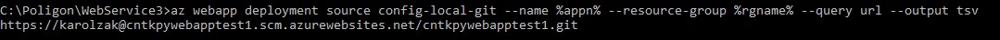
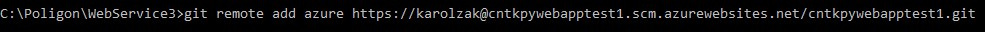

# Table of contents
- [Project description](#project-description)
- [Results](#results)
- [Deployment steps](#deployment-steps)
    - [Setup](#setup)
    - [Deploy demo](#deploy-demo)
- [Code highlights](#code-highlights)

# Project description
[[back to the top]](#table-of-contents)

This sample project shows off how to prepare and deploy to [Azure Web Apps](https://azure.microsoft.com/en-gb/services/app-service/web/) a simple Python web service with an image classifying model produced in [CNTK (Cognitive Toolkit)](https://github.com/Microsoft/CNTK) using [FasterRCNN](https://github.com/Microsoft/CNTK/tree/master/Examples/Image/Detection/FasterRCNN)

- [x] Web Service written in Python using Flask module
- [x] Python scripts that allow to evaluate images using CNTK and pretrained model
- [x] Custom deployment scripts for Azure Web Apps
- [x] Automatic setup of custom Python 3.5.x environment with all the required dependencies
- [ ] HTML UI for testing image classification
- [ ] Virtual Python environments for each application deployed to Azure Web Apps

# Results
[[back to the top]](#table-of-contents)

[Website Demo](http://cntkpywebapptest1.azurewebsites.net/):  


Sample request and response in Postman:


# Deployment steps

## Setup
[[back to the top]](#table-of-contents)


1. **Download content of this repo**

    You can either clone this repo or just download it and unzip to some folder

2. **Setup Python environment**

    In order for scripts to work you should have a proper Python environment. If you don't already have it setup then you should follow one of the online tutorials. To setup Python environment and all the dependencies required by CNTK on my local Windows machine I used [this tutorial](https://docs.microsoft.com/en-us/cognitive-toolkit/setup-windows-binary-script) 

3. **Download CNTK model and class map file**

    Go to `/CNTKModels` folder in the location were you unzipped this repo and run `download_model.py`. It will automatically download the pretrained model and class map file required for our evaluation to run properly.

4. **Install Azure CLI tools**

    If you don't have it then you can easily do it by openning Windows Command Prompt and running this command:
    ```Batchfile
    pip install azure-cli
    ```

5.  **Get Azure subscription**

    If you don't own any Azure subscriptions you can always create a [new free trial](https://azure.microsoft.com/en-us/free/) with $200 credits to spend
    
## Deploy demo
[[back to the top]](#table-of-contents)
1.  **Set variables**

    Open Command Prompt to the location where you unzipped the contents of this repository (for example: `cd C:\Poligon\WebService`) and type in as follows (but make sure to replace the `[]` with a proper value):

    ```
    set uname=[username]
    set pass=[password]
    set appn=[web_app_name]
    set rgname=[resource_group_name]
    ```

2.  **Login to Azure**

    In the same CMD type in:

    ```
    az login
    ```
    You should see something like this:

    

    Now go to the https://aka.ms/devicelogin website and type in the code:

    

    You will then be asked to login with an email connected to your Azure subscription

    If everything goes ok you should see the verification message on the website and in console you should see a list of your Azure subscriptions


3.  **Setup deployment credentials**

    We're setting this up to later be able to remotely deploy code to our Azure Web App
    ```
    az webapp deployment user set --user-name %uname% --password %pass%
    ```

4.  **Create resource group**

    Resource groups help you to better manage your stuff in subscription and it's a basic method of deploying services to Azure. [Read more here](https://docs.microsoft.com/en-us/azure/azure-resource-manager/resource-group-overview)

    ```
    az group create --location westeurope --name %rgname%
    ```

5.  **Create new [Azure App Service](https://azure.microsoft.com/en-us/services/app-service/) Plan and new [Azure Web App](https://azure.microsoft.com/en-us/services/app-service/web/)**

    ```
    az appservice plan create --name %appn% --resource-group %rgname% --sku S1
    az webapp create --name %appn% --resource-group %rgname% --plan %appn%
    ```

6.  **Configure Azure Web App and add Python extension**

    Azure Web Apps by default support only Python 2.7 and 3.4. Because I used Python 3.5 I had to use special [extension](https://azure.microsoft.com/en-us/blog/azure-web-sites-extensions/) to setup the environment

    First you need to change some [Application Settings](https://docs.microsoft.com/en-us/azure/app-service/web-sites-configure) on your Web App (the pink ones):
    
    Changing `Platform` is required and changing `Always On` is optional but I recommend to use it so that our web service stays awake even if not used.

    After we properly save Application Settings we can now add Python 3.5.x extension. In order to this, just type in `extensions` into the search box
    

    And then simply add new extension
    

    It should take around a minute or two to properly install the extension
    


7.  **Setup deployment source for newly created Azure Web App**

    This code will not only setup the deployment source for your app but will also retrive the URL you will need in next steps
    ```
    az webapp deployment source config-local-git --name %appn% --resource-group %rgname% --query url --output tsv
    ```
    It should return something like this:
    
    

8. **Initialize git and add remote repository**

    Make sure to replace `[remote_repo_address]` with the URL returned in step number 7.
    ```
    git init
    git remote add azure [remote_repo_address]
    ```
    Command with URL should look like this:
    

9.  **Push application to Azure Web App remote repository** 
    
    Last step is to simply push our applications code to Azure Web App 
    ```
    git add -A
    git commit -m "init"
    git push azure master
    ```

    This will trigger our [custom deployment script](deploy.cmd), copy all the files, setup Python environment and install all the required dependencies from [requirements.txt](requirements.txt) file

10. **Test the application**

    If everything went smooth you should now have a running Python application and you should be able to test it. I used Postman to test HTTP requests and responses

    [Website Demo](http://cntkpywebapptest1.azurewebsites.net/):  
    

    Sample request and response in Postman:
    

# Code highlights
[[back to the top]](#table-of-contents)


- [config.py](config.py) - most important variables for scripts are set in this file
    
    Variables used by web service to point out directories for temp images and CNTK models:

    ```Python    
    # directories for web service:
    __C.CNTK.TEMP_PATH = "./Temp" # temp folder for image processing - do not change
    __C.CNTK.MODEL_DIRECTORY = "./CNTKModels" # directory for storing models and class map files
    ```
    
    Variables for chosing the specific model:

    ```Python           
    __C.CNTK.MODEL_NAME = "HotailorPOC2.model" # model file name
    __C.CNTK.CLASS_MAP_FILE = "HotailorPOC2_class_map.txt" # class map file name
    ```

    Variables used by `evaluate.py` to properly preprocess images and use CNTK eval function:
    
    ```Python
    __C.CNTK.IMAGE_WIDTH = 1000
    __C.CNTK.IMAGE_HEIGHT = 1000
    __C.CNTK.NUM_CHANNELS = 3
    ```

- [app.py](app.py) - main application - startup file for Flask
    
    There is one very important line for running CNTK:
    ```Python
    [..]
    import os
    os.environ['PATH'] = r'D:\home\python354x64;' + os.environ['PATH']    
    [..]
    ```
    It adds the location of CNTK libraries to PATH variable. It's very important because our code strongly relies on that PATH. As for now I'm doing this in code but in future I want to move it to deployment script

    I am using Flask module to run my web service. In order to make it work I needed to first create an instance of Flask app and then run it on a proper port:

    ```Python
    [..]
    app = Flask(__name__)
    [..]    
    if __name__ == '__main__':
        HOST = os.environ.get('SERVER_HOST', 'localhost')
        try:
            PORT = int(os.environ.get('SERVER_PORT', '5555'))
        except ValueError:
            PORT = 5555
        app.run(HOST, PORT)
    ```
    I also used routes to set up specific methods for our RESTful web service. Currently I expose 2 routes for my API, one returning a collection of classified tags and the second one returning an image with plotted results of evaluation. `'/'` route simply sets the default landing page
    ```Python
    [..]
    @app.route('/')
    [..]
    @app.route('/hotelidentifier/api/v1.0/evaluate/returntags', methods=['POST'])
    [..]
    @app.route('/hotelidentifier/api/v1.0/evaluate/returnimage', methods=['POST'])
    [..]
    ```

- [evaluate.py](evaluate.py) - main script for image classification with CNTK model
    
    This script strongly depends on [config.py](config.py) and it also uses [cntk_helpers.py](cntk_helpers.py), [plot_helpers.py](plot_helpers.py) and bunch of scripts from [utils](utils) folder. Most of those scripts were copied from original [CNTK source on github](https://github.com/Microsoft/CNTK), some of them with slight changes

- [plot_helpers.py](evaluate.py) - helper script for dealing with image ploting

    While working with headless server environment (non-GUI) such as Azure Web Apps you need to change the default mode of `matpotlib` module to not rely on GUI
    ```Python  
    [..]
    # this is important when deploying to headless server environment (non-GUI)
    ###################################################
    import matplotlib
    # force headless backend, or set 'backend' to 'Agg'
    # in your ~/.matplotlib/matplotlibrc
    matplotlib.use('Agg')

    import matplotlib.pyplot
    # force non-interactive mode, or set 'interactive' to False
    # in your ~/.matplotlib/matplotlibrc
    from matplotlib.pyplot import imsave
    matplotlib.pyplot.ioff()
    ###################################################    
    [..]
    ```

- [requirements.txt](requirements.txt)

    It holds all the dependencies required by my application and CNTK libraries to work.
    ```
    easydict==1.6
    pytest==3.0.3
    opencv-python
    https://pypi.python.org/packages/be/5c/670e88bc3ae6afa23c1f09d52a77bbbc7d2e476e7449ad3b6750040a0ac6/scipy-1.0.0b1-cp35-none-win_amd64.whl#md5=dcc90577f2eebc264ec60a2d5729e30b
    https://cntk.ai/PythonWheel/CPU-Only/cntk-2.1-cp35-cp35m-win_amd64.whl
    Flask==0.12.2
    numpy==1.11.2
    matplotlib==1.5.3
    ipython==6.2.0
    Pillow==4.1.1
    PyYAML==3.12
    ```
    As you can see in most cases we use specific versions of modules and sometimes we even explicitly point out the correct .whl file to use for installation

- [.deployment](.deployment)

    If this file is present, Kudu will use custom `deploy.cmd` file instead of the default one. We use custom deployment script to chose Python3.5 and install all the necesary dependencies. To learn more about Kudu and deploying to Azure Web Apps - [go here](https://azure.microsoft.com/en-gb/resources/videos/what-is-kudu-with-david-ebbo/)
    ```
    [config]
    command = deploy.cmd
    ```

- [deploy.cmd](deploy.cmd)

    Custom script for our deployment with Kudu. Main difference from the default script is that I'm setting Python3.5 (installed from extension) as my main environment

    ```
    [..]
    SET PYTHON_DIR=%SYSTEMDRIVE%\home\python354x64
    SET PYTHON_EXE=%SYSTEMDRIVE%\home\python354x64\python.exe
    [..]
    ```

    I'm also using `deploy.cmd` to install all the required dependencies:
    ```CMD
    [..]
    :: 4. Install packages
    echo Pip install requirements.
    echo "Installing requirements"
    %PYTHON_EXE% -m pip install -r requirements.txt
    [..]
    ```

    **TODO:**
    I was told that it is better to have virtual Python environment for each app hosted on Azure Web Apps so that there is no chance of conflicts in different versions of modules used by different apps. That is what I need to fix in future.


- [web.config](web.config)

    I used `web.config` to point out the directory of my custom Python 3.5 installation and to successfully run my Flask based Python web service. I based my `web.config` on Azure Web Apps [documentation](https://docs.microsoft.com/en-us/azure/app-service/web-sites-python-configure).

    ```xml
    <?xml version="1.0" encoding="utf-8"?>
    <configuration>
    <system.webServer>
        <handlers>
            <add name="PythonHandler" path="*" verb="*" modules="httpPlatformHandler" resourceType="Unspecified"/>
        </handlers>
        <httpPlatform processPath="D:\home\python354x64\python.exe"
                    arguments="D:\home\site\wwwroot\app.py --port %HTTP_PLATFORM_PORT%"
                    stdoutLogEnabled="true"
                    stdoutLogFile="D:\home\site\wwwroot\logs\log_file2.log"
                    startupTimeLimit="220"
                    processesPerApplication="5">
            <environmentVariables>
                <environmentVariable name="SERVER_PORT" value="%HTTP_PLATFORM_PORT%" />
            </environmentVariables>
        </httpPlatform>
    </system.webServer>
    </configuration>
    ```
    
    
